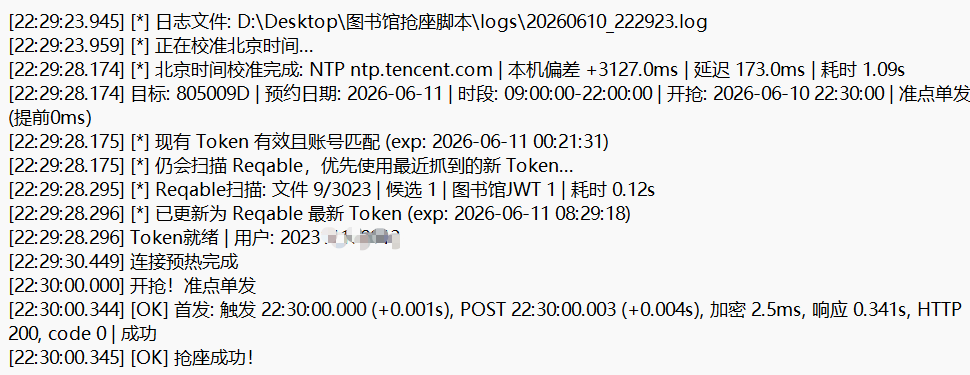

# 图书馆抢座脚本

用于山东科技大学图书馆座位预约的 Python 脚本。脚本会读取 `user_data.json`，通过 Reqable 抓包自动提取一点通小程序里的图书馆 Token，并在配置的开抢时间提交预约请求。

> 仅供学习和个人自动化使用。请遵守学校图书馆相关规定，不要高频请求，不要影响系统正常运行。

## 功能

- 自动读取 `user_data.json` 配置。
- 自动扫描 Reqable 抓包目录，提取有效的图书馆 JWT Token。
- Token 有效且账号匹配时直接复用。
- 可自动把预约日期更新为明天，也可关闭后手动指定日期。
- 支持配置座位号、预约日期、预约时段、开抢时间。
- 支持 NTP/HTTP 北京时间校准，不修改系统时间。
- 校时请求会并行采样，避免多个服务器顺序超时导致启动卡住。
- 支持准点单发，失败后按间隔自动捡漏。
- 捡漏间隔会自动限制为至少 `5.0` 秒，降低触发“操作频繁”的概率。
- 启动时会检查单实例，防止双开脚本互相触发频控。
- 预约结束时间已过时会停止运行，避免旧日期配置误发请求。
- 每次运行会在 `logs/` 目录生成 UTF-8 日志文件，方便回看首发和捡漏结果。
- 等待开抢时，控制台会每秒刷新倒计时；按回车可以取消。

## 文件说明

```text
main.py              主程序：读取配置、校时、获取 Token、定时提交预约
token_refresher.py   单独刷新 Token 的工具
reqable_token.py     Reqable 抓包目录查找、Token 扫描、JWT 校验工具
cleanup_reqable_capture.py 清理 Reqable 旧抓包文件的工具，默认只预览
crypto_core.py       加密和 yStr 生成逻辑
login.py             登录接口尝试工具，目前主流程主要依赖 Reqable 抓包 Token
user_data.json       个人配置文件，包含账号、Token 等敏感信息，不要上传
user_data.example.json 配置示例文件
启动.bat             Windows 一键启动脚本
logs/               每次运行生成的日志文件目录
```

## 环境要求

- Windows
- Python 3.10 或更高版本
- Reqable 抓包工具
- 微信一点通小程序

安装依赖：

```bash
pip install requests urllib3 pycryptodome
```

## 使用前准备

1. 安装并打开 Reqable。
2. 确保 Reqable 已开启 HTTPS 抓包能力。
3. 打开微信。
4. 打开一点通小程序，让小程序正常加载并产生图书馆相关请求。
5. 保持 Reqable 打开，然后运行脚本。

脚本会自动扫描 Reqable 的抓包目录，从最近的抓包文件中提取 Token，并写入 `user_data.json`。

## 配置说明

首次运行如果没有 `user_data.json`，脚本会自动生成模板。也可以参考 `user_data.example.json` 手动创建：

```json
{
    "token": "",
    "student_id": "你的学号",
    "password": "你的密码",
    "target_date": "2026-05-23",
    "auto_update_target_date": true,
    "seat_code": "301010A",
    "snipe_time": "22:30:00",
    "start_hour": "09:00:00",
    "end_hour": "22:00:00",
    "fire_advance_ms": 0,
    "time_sync_enabled": true,
    "time_sync_servers": [
        "ntp.aliyun.com",
        "ntp.tencent.com",
        "ntp.ntsc.ac.cn",
        "time.windows.com"
    ],
    "time_sync_timeout": 1.0,
    "time_sync_samples": 3,
    "snipe_cooldown": 3,
    "snipe_interval": 5.0,
    "min_snipe_interval": 5.0,
    "snipe_max": 99999,
    "request_timeout": 3
}
```

| 字段 | 说明 |
| --- | --- |
| `token` | 一点通图书馆 Token，可留空，脚本会尝试从 Reqable 抓包中自动获取 |
| `student_id` | 学号，用于校验 Token 是否属于当前账号 |
| `password` | 密码，目前主流程主要依赖抓包 Token |
| `target_date` | 要预约的日期，格式为 `YYYY-MM-DD` |
| `auto_update_target_date` | 是否每次运行时自动把 `target_date` 改成明天 |
| `seat_code` | 座位号，例如 `301010A` |
| `snipe_time` | 开抢时间，例如 `22:30:00` |
| `start_hour` | 预约开始时间 |
| `end_hour` | 预约结束时间 |
| `fire_advance_ms` | 首发请求提前多少毫秒触发，`0` 表示按开抢时间准点触发 |
| `time_sync_enabled` | 是否启用北京时间校准，默认开启 |
| `time_sync_servers` | NTP 校时服务器列表 |
| `time_sync_timeout` | 单次校时超时时间，单位秒 |
| `time_sync_samples` | 每个 NTP 服务器采样次数，脚本会优先采用网络延迟最低的一次 |
| `snipe_cooldown` | 首发失败后，等待几秒进入捡漏 |
| `snipe_interval` | 捡漏请求间隔，默认 `5.0` 秒 |
| `min_snipe_interval` | 捡漏请求最小间隔，默认 `5.0` 秒，低于该值会自动拉回 |
| `snipe_max` | 最大捡漏次数 |
| `request_timeout` | 单次预约请求超时时间，单位秒 |

## 日期和开抢时间逻辑

如果 `auto_update_target_date` 为 `true`，脚本每次运行会自动把 `target_date` 改成明天。

如果要手动指定预约日期，把它改成 `false`：

```json
"auto_update_target_date": false
```

脚本的实际开抢时间按下面规则计算：

```text
实际开抢时间 = target_date 的前一天 + snipe_time
```

例如：

```json
"target_date": "2026-05-23",
"snipe_time": "22:30:00"
```

实际开抢时间就是：

```text
2026-05-22 22:30:00
```

如果运行时已经过了实际开抢时间，脚本会立即执行一次，然后进入捡漏策略。

## 准点抢说明

当前脚本是“准点单发”逻辑：

```text
首发触发时间 = 实际开抢时间 - fire_advance_ms
```

当 `fire_advance_ms` 为 `0` 时，首发会等到实际开抢时间再触发。脚本启动后会先校准北京时间，并用校准后的时间计算等待时间；等待的最后一段使用 `time.perf_counter()` 忙等，提高毫秒级触发稳定性。预约前还会提前预热 HTTPS 连接，减少首发时建立连接的耗时。

需要注意：

- “准点”指脚本开始执行首发请求的时刻贴近 `snipe_time`，不是服务器收到请求的绝对时刻。
- 真正到达服务器还会受本机性能、Python 调度、网络延迟、服务器排队等影响。
- 日志中的 `首发: 发出 HH:MM:SS.mmm (+0.000s)` 可以用来观察实际触发偏差。
- 如果想略微提前发包，可以把 `fire_advance_ms` 设置为几十毫秒，例如 `30` 或 `50`；不确定时保持 `0`。

## 运行方法

方式一：双击运行

```text
启动.bat
```

方式二：命令行运行

```bash
python main.py
```

单独刷新 Token：

```bash
python token_refresher.py
```

清理 Reqable 旧抓包文件：

```bash
python cleanup_reqable_capture.py
```

默认只预览，不会删除。确认后再执行：

```bash
python cleanup_reqable_capture.py --keep-hours 24 --delete
```

## 日志文件

`main.py` 每次启动都会创建一个日志文件：

```text
logs/年月日_时分秒.log
```

窗口里显示的内容会同步写入这个文件。遇到乱码、首发失败、返回“操作频繁”或没抢到时，优先打开最新的日志文件查看：

```text
日志文件: D:\...\logs\20260604_223000.log
首发: 发出 22:30:00.000 (+0.000s), 响应 0.123s | ...
```

日志文件使用 UTF-8 编码。如果窗口仍然乱码，以 `logs/` 里的文件内容为准。

成功日志示例：



## 推荐使用流程

1. 打开 Reqable。
2. 打开微信一点通小程序，等待加载完成。
3. 检查 `user_data.json` 中的座位号、预约日期、预约时段和 `snipe_time`。
4. 运行 `python main.py` 或双击 `启动.bat`。
5. 如果 Token 有效，脚本会直接复用。
6. 如果 Token 无效，脚本会尝试从 Reqable 抓包记录中自动提取新 Token。
7. 到达开抢时间后，脚本会自动提交预约。
8. 首发失败后，脚本会等待 `snipe_cooldown` 或服务器提示的等待时间，再进入捡漏。

不要同时打开多个脚本窗口。同一账号双开会让两个进程一起请求，容易触发“操作频繁”。脚本现在会拦截双开，但正式抢座前仍建议只保留一个窗口。

## 常见问题

### 找不到 Reqable 抓包目录

请确认：

- Reqable 已经打开。
- Reqable 正常开启抓包。
- 微信一点通小程序已经打开并加载完成。
- 当前电脑用户有 Reqable 抓包目录。

### 未从抓包中找到 Token

可以尝试：

- 重新打开一点通小程序。
- 在 Reqable 中确认能看到 `tsg77.sdust.edu.cn` 相关请求。
- 等待几秒后重新运行脚本。
- 删除 `user_data.json` 里的旧 `token` 后重新抓取。

### 脚本还在等待 22:30

检查 `target_date` 和 `snipe_time`。脚本的实际开抢时间是 `target_date` 前一天的 `snipe_time`。

例如预约 `2026-05-24`，开抢时间就是 `2026-05-23 22:30:00`。

### 想确认是不是准点触发

运行后看首发日志：

```text
首发: 发出 22:30:00.000 (+0.000s)
```

括号里的值越接近 `+0.000s`，说明越贴近准点。正数代表晚于开抢时间，负数代表提前发送；如果配置了 `fire_advance_ms`，出现对应的负数是正常的。
